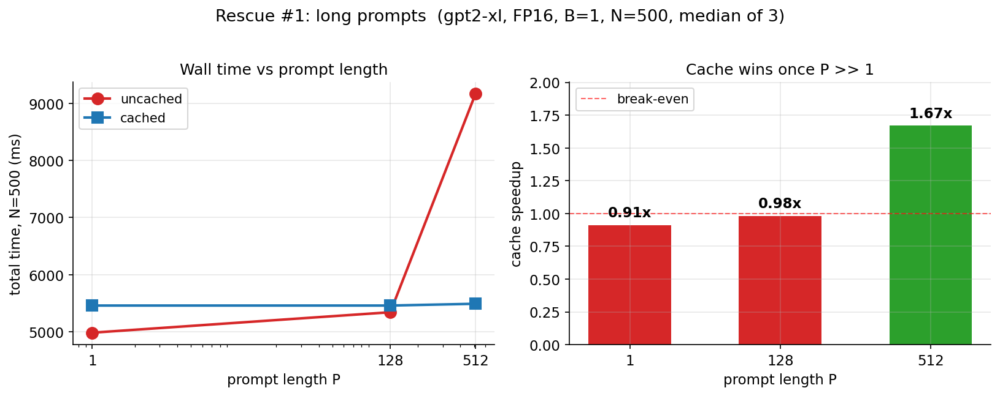
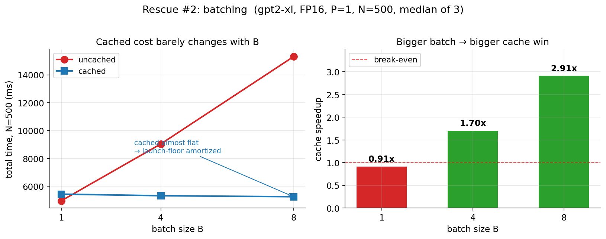
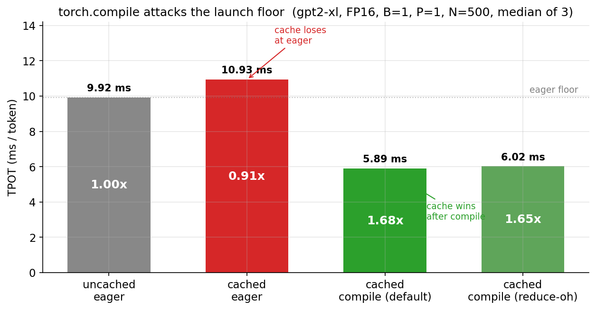
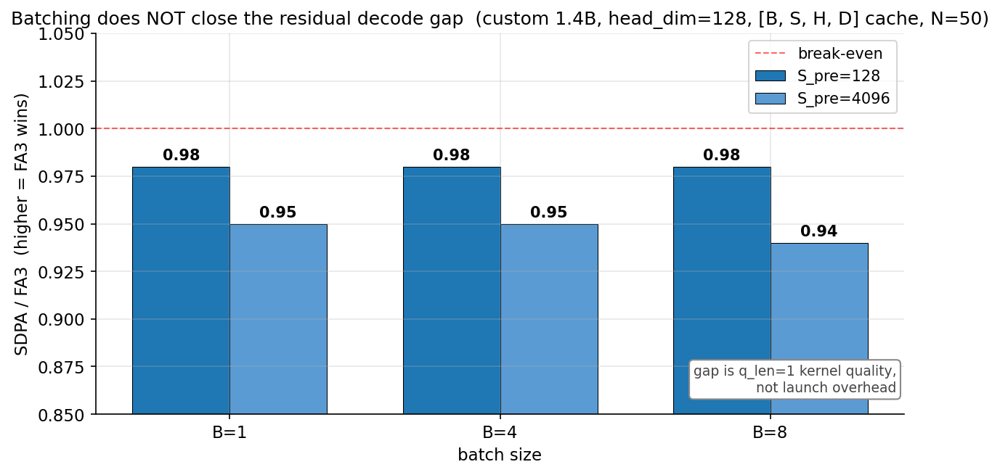

*Benchmarked on a single NVIDIA H100; Tensor Parallelism runs on 2×H100.*

<!--
  POST OUTLINE for the section-by-section coaching notes
  (Goal / Show / Claim / Key points for each section).
  Replace the *[draft]* placeholders with prose.
-->

## 1. Why this post

*[draft section 1 here §1]*

## 2. Background: nanoGPT in 60 seconds

*[draft section 2 here §2]*

## 3. Adding the KV cache

*[draft section 3 here §3]*

## 4. The FP16 surprise

*[draft section 4 here §4]*

## 5. Where does the time go?

*[draft section 5 here §5]*

## 6. Three rescues for the FP16 cache

### 6.1 Long prompts

*[draft §6.1]*

### 6.2 Batching

*[draft §6.2]*

### 6.3 torch.compile

*[draft §6.3]*

### 6.4 Stacking the rescues

*[draft §6.4]*

### 6.5 Long generation

*[draft §6.5]*

## 7. Picking an attention backend

*[draft section 7 here §7]*

## 8. When does FlashAttention-3 actually win?

### 8.1 Llama-like shapes

*[draft §8.1]*

### 8.2 The KV cache layout question

*[draft §8.2]*

### 8.3 Does GQA finally make FA3 win decode?

*[draft §8.3]*

### 8.4 What about FP8? (A cautionary tale)

*[draft §8.4]*

## 9. What we learned

*[draft section 9 here §9]*

### 9.1 TTFT vs batch size

*TTFT is reported as `prefill + first decode step` (first-step approximated with TPOT from the same run).*

### 9.2 Throughput vs per-user latency (Pareto)

## 10. References

- **Andrej Karpathy** — [nanoGPT](https://github.com/karpathy/nanoGPT). The
  architecture, the weight-loading-from-HF pattern, and the tasteful 200-line
  forward pass are all his.
- **Tri Dao et al.** — [FlashAttention](https://github.com/Dao-AILab/flash-attention)
  papers and the prebuilt FA3 wheel on H100 used in step-5/6.
- **PyTorch SDPA team** — the dispatcher that "just works" and picks Flash /
  cuDNN / memory-efficient under the hood without us asking.

---

*Code, logs, and plot-generation scripts are at [github.com/venkatacrc/nanogpt-kv-cache](https://github.com/venkatacrc/nanogpt-kv-cache).*
