*Benchmarks throughout this guide were collected on a single NVIDIA H100. Step 8 (Tensor Parallelism) requires 2 GPUs.*

## Overview

### Who this is for
Engineers and students who know basic Python and have seen a transformer once, and want to understand model inference deeply enough to reason about its performance — not just call an inference framework.

### What you will learn
- How autoregressive decoding works at the loop level, and why a naïve implementation is \\(O(N^2)\\) per step.
- How a KV cache reduces per-step work to \\(O(N)\\), and why that does not always translate to a speedup in practice.
- How to decompose end-to-end latency into prefill, decode, kernel-launch, and memory-bandwidth components.
- How attention backends (manual, SDPA, FlashAttention-3) differ, and when each one wins.
- How architectural choices — head dimensions, KV layout, grouped-query attention — interact with kernel implementations.
- How tensor parallelism redistributes computation across GPUs, and what it costs.
- How to read a throughput-vs-latency Pareto curve and pick an operating point.

### Prerequisites
- Python 3.10+ and PyTorch 2.5+.
- A GPU. Steps 0–4 run anywhere modern. SDPA paths need Ampere+ (A100/H100). FlashAttention-3 paths need Hopper (H100/H200). Step 8 needs 2 GPUs.
- Background on transformers at the level of [Karpathy's nanoGPT](https://github.com/karpathy/nanoGPT).

### How to use this guide
Each step is a self-contained folder with `model.py`, a benchmark or test script, and a saved log file. The recommended loop is:

1. Read the step's idea and implementation here.
2. Run the script in the folder.
3. Compare your output to the saved `.log` file.
4. Read the analysis here only after you have your own numbers.

The point is not to reproduce the benchmark exactly — it is to build the mental model.

### The journey at a glance
| # | Step | What you add |
|---|---|---|
| 0 | Baseline | nanoGPT's original decode loop, with no cache. |
| 1 | KV Cache | Store keys and values across decode steps. |
| 2 | FP16 | Run the cached path in half precision. |
| 3 | Decomposition | Measure where time actually goes per step. |
| 4 | Rescues | Three independent fixes for cached decode at small batch. |
| 5 | Backends | Manual attention vs PyTorch SDPA vs FlashAttention-3. |
| 6 | Making FA3 win | Llama-style head shapes and FA3-native KV layout. |
| 7 | GQA | Grouped-Query Attention: fewer KV heads, smaller cache. |
| 8 | Tensor Parallelism *(optional, 2 GPUs)* | Split the model across two H100s. |
| 9 | Throughput-Latency Pareto | Sweep batch size; observe the tradeoff. |
| A | Appendix | Sweeps over model size and generation length; an FP8 cautionary tale. |

### A note on style
This is a learning artifact, not a benchmark report or a production engine. Frameworks like vLLM, TGI, and TensorRT-LLM exist for production. The goal here is for you to be able to predict, *before* you run a benchmark, roughly how it will behave — and to be able to explain it afterward.

---

## Step 0 — Baseline

### What we're building
> One sentence. Which file does this step modify, and what is the smallest possible decode loop you can run?

### The idea
> Two short paragraphs, no code:
> 1) What does autoregressive generation actually do per step in the original nanoGPT loop?
> 2) Why is the per-step cost \\(O(N^2)\\) instead of \\(O(N)\\), and what is being recomputed?

### The implementation
> Show the smallest snippet (5–15 lines) from `step-0-baseline/model.py` that defines the decode loop. Annotate why each line exists; do not paste the entire file.

```python
# TODO: paste the annotated snippet here
```

[Full code: step-0-baseline/model.py](https://github.com/venkatacrc/nanogpt-kv-cache/blob/main/step-0-baseline/model.py)

### Running it

```bash
cd step-0-baseline/
python bench.py
```

> Expected runtime on H100? Note it here once you measure it.

### Results
> Paste the relevant lines from `step-0-baseline/bench.log`.

### What the numbers mean
> Walk through the output line by line. State your hypothesis before running, then compare against what actually happened. If they disagree, that is the lesson.

### What we learned
> One or two sentences. End with the question this step opens for Step 1.

---

## Step 1 — KV Cache

### What we're building
> One sentence. Name the new class you introduce in `step-1-kvcache/model.py`.

### The idea
> Two short paragraphs:
> 1) What information are we storing across decode steps, and why is it safe to reuse?
> 2) What does each per-step operation become once the cache exists? Be precise about which dimensions shrink.

### The implementation
> Snippet of the `KVCache` class plus the cache-aware attention call. Annotate the layout `[B, H, S, D]` and why prefill writes the full prompt while decode appends one position.

```python
# TODO: paste the annotated KV cache snippet
```

[Full code: step-1-kvcache/model.py](https://github.com/venkatacrc/nanogpt-kv-cache/blob/main/step-1-kvcache/model.py)

### Running it

```bash
cd step-1-kvcache/
python test_correctness.py   # bit-exact vs uncached in FP32
python bench.py              # speed comparison
```

### Results
> Paste a short table from `bench_gpt2xl.log` showing uncached vs cached TPOT.

### What the numbers mean
> What speedup did you observe? How does it scale with the number of generated tokens \\(N\\)? Was the cached path bit-exact in FP32? Why does this work?

### Plot — FP32 cache speedup on gpt2-xl

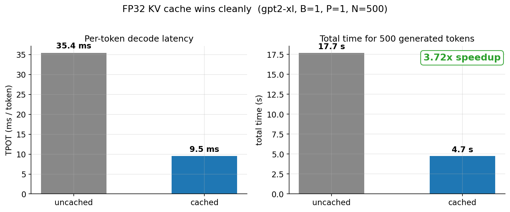

*What to look at: the cached curve flattens while the uncached curve grows with \\(N\\).*

### What we learned
> One or two sentences. What question does this open for Step 2?

---

## Step 2 — FP16

### What we're building
> One sentence. The model and the cache both move to half precision.

### The idea
> Two short paragraphs:
> 1) What does FP16 change about memory footprint and arithmetic?
> 2) State the *expected* behavior — should the cached path get faster, slower, or unchanged? Write your hypothesis here before you run the script.

### The implementation
> The diff is small. Show only the cast points: model weights, KV cache tensors, and any explicit `dtype` arguments.

```python
# TODO: paste the FP16 cast snippet
```

[Full code: step-2-fp16/model.py](https://github.com/venkatacrc/nanogpt-kv-cache/blob/main/step-2-fp16/model.py)

### Running it

```bash
cd step-2-fp16/
python test_correctness.py
python bench.py
```

### Results
> Paste the gpt2-xl B=1, P=1 row from `bench.log`.

### What the numbers mean
> Compare your FP16 result to your FP32 result from Step 1. Does the cache still win? If not, do not explain it yet — Step 3 is for that. Just state clearly what happened versus what you predicted.

### Plot — FP32 vs FP16 cache speedup

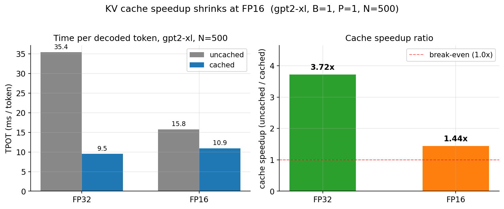

*What to look at: the gap between the FP32 and FP16 curves, especially at small batch.*

### What we learned
> One or two sentences. End with the precise question Step 3 will answer.

---

## Step 3 — Decomposition

### What we're building
> One sentence. We do not change the model. We change the *measurement*.

### The idea
> Two short paragraphs:
> 1) Why is end-to-end TPOT not enough information to explain Step 2's result?
> 2) What does it mean to split per-step time into kernel launch, attention compute, projection compute, and other components? What is a "launch floor"?

### The implementation
> Show the timing-instrumentation snippet from `step-3-decomp/decomp.py`. Annotate where you synchronize, what you accumulate, and why you discard the first few iterations.

```python
# TODO: paste the timing decomposition snippet
```

[Full code: step-3-decomp/decomp.py](https://github.com/venkatacrc/nanogpt-kv-cache/blob/main/step-3-decomp/decomp.py)

### Running it

```bash
cd step-3-decomp/
python decomp.py
```

### Results
> Paste the per-component table from `decomp.log`.

### What the numbers mean
> Which component dominates cached decode at B=1? How does that compare to uncached decode? What does this tell you about *why* FP16 cached decode lost in Step 2?

### Plot — Per-step time decomposition

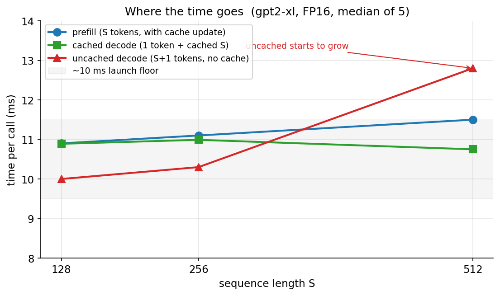

*What to look at: the floor that does not shrink no matter how small the model gets.*

### What we learned
> One or two sentences. State the cause of the Step 2 anomaly in your own words.

---

## Step 4 — Rescues

### What we're building
> One sentence. Three independent levers that change cached-decode economics, all in `step-4-rescues/`.

### The idea
> Three short paragraphs, one per rescue. For each, state the mechanism in one sentence:
> - Long prompts: what changes about the prefill/decode ratio?
> - Larger batches: what does batching share, and what does it not share?
> - `torch.compile`: what part of the launch floor does it actually attack?

> Then a fourth paragraph: if each rescue gives you some speedup, what would you naively predict from combining them — and why might that prediction be wrong?

### The implementation
> Pick *one* rescue and show its key line. The other two follow the same shape.

```python
# TODO: paste one representative rescue snippet
```

[Full code: step-4-rescues/](https://github.com/venkatacrc/nanogpt-kv-cache/tree/main/step-4-rescues)

### Running it

```bash
cd step-4-rescues/
python long_prompt.py   # prompt length sweep
python batch.py         # batch size sweep
python compile.py       # torch.compile vs eager
python stack.py         # combined: predicted vs measured
```

### Results
> Paste headline numbers from each `.log` file. Then paste the predicted-vs-measured row from `stack.log`.

### What the numbers mean
> For each rescue, was the speedup larger or smaller than you expected? When you stacked them, did the result equal the product of the individual speedups? What does the gap tell you about shared bottlenecks?

### Plot — Stacked rescues, predicted vs measured

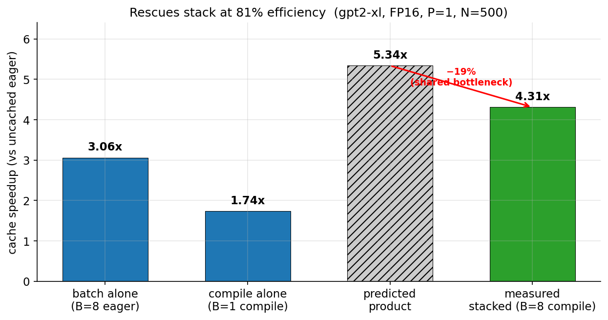

*What to look at: the difference between the bars labeled "predicted" and "measured".*

### What we learned
> Two sentences. End with what changes once we leave gpt2 shapes behind in Step 5.

---

## Step 5 — Attention Backends

### What we're building
> One sentence. Make the attention implementation selectable in `step-5-backends/model.py`: manual, PyTorch SDPA, FlashAttention-3.

### The idea
> Two short paragraphs:
> 1) What does an "attention backend" actually mean? What are the three options doing differently at the kernel level?
> 2) Form a hypothesis: which backend should win at prefill, which at decode, and at what shapes? Write it down before measuring.

### The implementation
> Show the dispatch site — the small block that selects between manual / SDPA / FA3 based on a config flag.

```python
# TODO: paste the backend dispatch snippet
```

[Full code: step-5-backends/model.py](https://github.com/venkatacrc/nanogpt-kv-cache/blob/main/step-5-backends/model.py)

### Running it

```bash
cd step-5-backends/
python test_backends.py        # numerical agreement
python bench_backends.py       # prefill + decode benchmarks
```

### Results
> Paste two short tables from `bench_backends.log`: one for prefill, one for decode.

### What the numbers mean
> Which backend won prefill? Which won decode? Compare to your hypothesis. Why might FA3 *lose* to SDPA at gpt2 shapes (`head_dim=64`)?

### Plot — Backends, prefill and decode

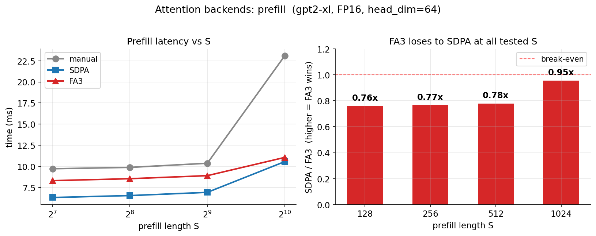
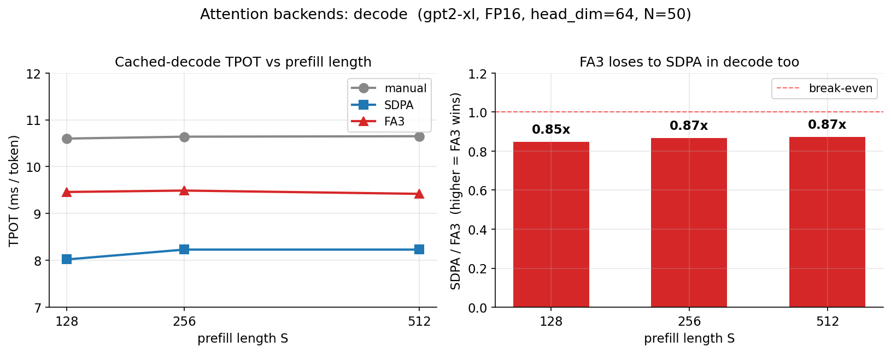

*What to look at: the relative ranking of the three backends changes between the two plots.*

### What we learned
> Two sentences. What architectural change might let FA3 finally win?

---

## Step 6 — Making FA3 Win

### What we're building
> One sentence. We rebuild the model at Llama-style shapes (`head_dim=128`, longer context) **and** refactor the KV cache layout to FA3's preferred ordering. This step merges what was previously split across `step-6-shapes/` and `step-6b-layout/`.

### The idea
> Three short paragraphs:
> 1) Why is `head_dim=128` more friendly to Hopper tensor cores than `head_dim=64`?
> 2) What is the difference between a `[B, H, S, D]` cache layout and a `[B, S, H, D]` layout from the kernel's point of view?
> 3) Predict: between bigger heads, longer context, and a friendlier layout, which one closes the FA3 prefill gap and which one closes the decode gap?

### The implementation
> Two snippets side by side: the shape config, and the layout transpose at write/read time.

```python
# TODO: paste shape config + layout snippets
```

[Full code: step-6-shapes/](https://github.com/venkatacrc/nanogpt-kv-cache/tree/main/step-6-shapes)
[Full code: step-6b-layout/](https://github.com/venkatacrc/nanogpt-kv-cache/tree/main/step-6b-layout)

### Running it

```bash
cd step-6-shapes/
python bench_shapes.py            # FA3 vs SDPA at Llama shapes

cd ../step-6b-layout/
python bench_layout.py            # decode with FA3-native layout
python bench_batch_decode.py      # does batching close the residual gap?
```

### Results
> Paste a short table covering: prefill at S=2K and S=16K, decode at B=1 and B=8.

### What the numbers mean
> How much of the prefill improvement came from `head_dim=128` alone? How much of the decode improvement came from layout? Is there residual gap that neither shape nor layout closes — and what would explain it?

### Plot — FA3 prefill scaling and decode layout

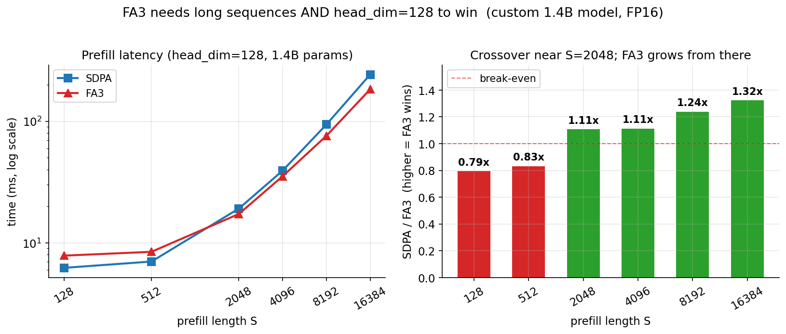
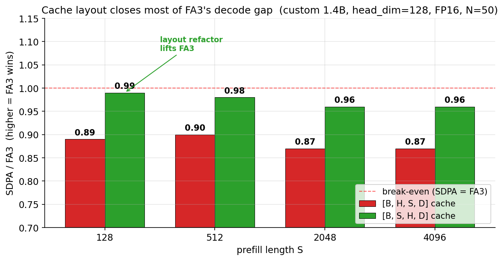

*What to look at: where the FA3 line crosses the SDPA line in the prefill plot, and how the gap shifts with layout in the decode plot.*

### What we learned
> Two sentences. End with the architectural decision Step 7 will make.

---

## Step 7 — Grouped-Query Attention

### What we're building
> One sentence. End-to-end GQA support in `step-8-gqa/model.py` (legacy folder name; the step is "Step 7" in this guide).

### The idea
> Two short paragraphs:
> 1) What is GQA, structurally? How do `n_head` and `n_kv_head` differ, and what gets shared?
> 2) Predict the effects on three things: KV cache memory, decode speed, and prefill speed. Which one should benefit most?

### The implementation
> Show the head-grouping snippet — the part where queries are reshaped into groups and the smaller K/V are broadcast or repeated.

```python
# TODO: paste the GQA grouping snippet
```

[Full code: step-8-gqa/model.py](https://github.com/venkatacrc/nanogpt-kv-cache/blob/main/step-8-gqa/model.py)

### Running it

```bash
cd step-8-gqa/
python test_gqa.py        # correctness sweeps over n_kv_head
python bench_gqa.py       # SDPA vs FA3 prefill + decode
```

### Results
> Paste two short tables from `bench_gqa.log`: one for prefill, one for decode, sweeping `n_kv_head`.

### What the numbers mean
> Did decode TPOT improve, stay flat, or get worse as you reduced `n_kv_head`? What happened to KV memory? Which of these is the "real" GQA win on H100?

### Plot — GQA: decode and prefill

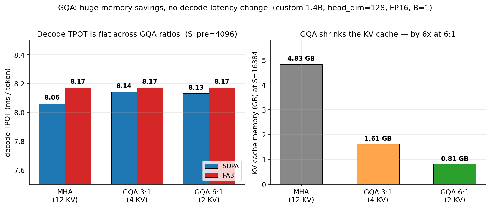
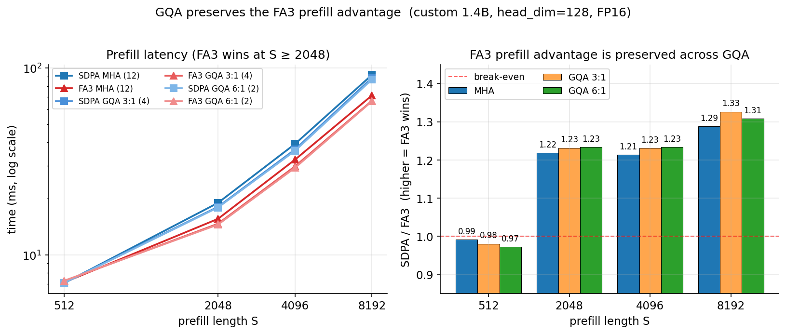

*What to look at: separate the latency axis from the memory axis on the decode plot.*

### What we learned
> Two sentences. End with the question Step 8 (or Step 9, if you skip TP) will answer.

---

## Step 8 — Tensor Parallelism *(optional, requires 2 GPUs)*

### What we're building
> One sentence. A tensor-parallel version of the model in `step-10-tp/` that splits weights across two H100s.

### The idea
> Two short paragraphs:
> 1) What is tensor parallelism? Which weights are sharded along which dimension, and where do collectives appear in the forward pass?
> 2) Predict: where should TP-2 help (prefill or decode?), and where should it hurt? Why does communication cost matter more for one phase than the other?

### The implementation
> Show the partition + collective skeleton: how a column-parallel linear and a row-parallel linear pair up around an `all_reduce`.

```python
# TODO: paste the TP partition + all_reduce snippet
```

[Full code: step-10-tp/model.py](https://github.com/venkatacrc/nanogpt-kv-cache/blob/main/step-10-tp/model.py)

### Running it

```bash
cd step-10-tp/
python bench_tp.py       # 1 GPU baseline (uses cuda:0)
torchrun --nproc_per_node=2 run_tp2.py
```

### Results
> Paste prefill and decode rows from `bench_tp.log` and `run_tp2.log`. Compare TP-1 vs TP-2.

### What the numbers mean
> Did prefill speed up? By how much? Did decode TPOT improve, stay flat, or regress? What does the answer tell you about the relative cost of compute and NCCL communication?

### Plot — TP scaling tradeoff

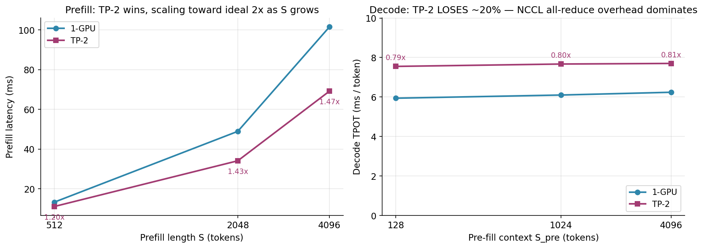

*What to look at: prefill and decode scale differently with TP. The decode regression is the lesson.*

### What we learned
> Two sentences. End with: when is TP a good idea on a model that fits on one GPU?

---

## Step 9 — Throughput-Latency Pareto

### What we're building
> One sentence. A batch-size sweep in `step-11-pareto/bench_pareto.py` that produces a single plot summarizing every previous step.

### The idea
> Two short paragraphs:
> 1) Define the two axes precisely: per-user latency (TPOT, or TTFT) and total throughput (tokens/sec across all batched users). Why is there a tradeoff at all?
> 2) Predict the shape of the curve before you plot it. At what batch size do you expect TPOT to start visibly degrading?

### The implementation
> Show the outer batch sweep loop and how TPOT, throughput, and a TTFT proxy are recorded.

```python
# TODO: paste the batch sweep snippet
```

[Full code: step-11-pareto/bench_pareto.py](https://github.com/venkatacrc/nanogpt-kv-cache/blob/main/step-11-pareto/bench_pareto.py)

### Running it

```bash
cd step-11-pareto/
python bench_pareto.py
```

### Results
> Paste the batch sweep table from `bench_pareto.log`.

### What the numbers mean
> At what batch size does throughput stop growing linearly? At what batch size does per-user latency start to degrade noticeably? If you had to pick a single operating point for a chat workload vs a batch summarization workload, which point would you pick on the curve, and why?

### Plot — Throughput vs per-user latency

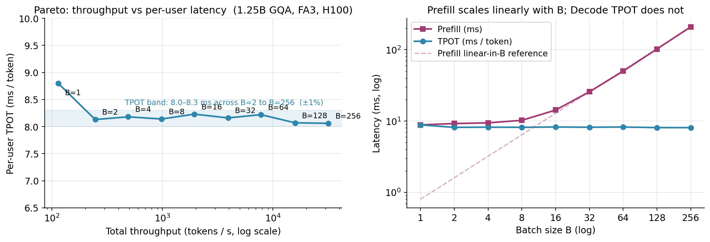
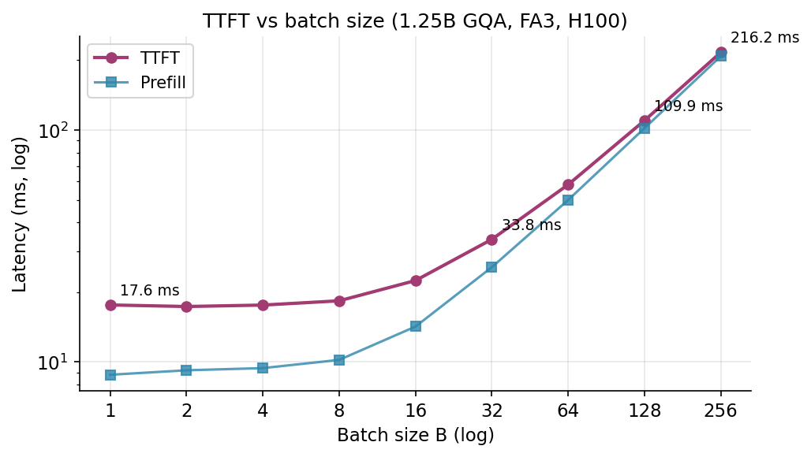

*What to look at: the elbow of the Pareto curve, and how TTFT grows with batch size while TPOT stays nearly flat.*

### What we learned
> Two or three sentences — this is the closing step. Tie it back to the original question: why does inference performance depend on every choice we made in Steps 0–8?

---

## Appendix A1 — Sweeps over model size and generation length

> *This appendix corresponds to the legacy `step-7-extras/` folder. It is supporting evidence for Steps 1–4, not new material.*

### What we're checking
> One sentence. Do the conclusions from Steps 1–4 still hold as we scale model size up and generation length out?

### The idea
> One paragraph. Which conclusions from earlier steps could plausibly be artifacts of gpt2-xl or of short generation, and which should hold universally?

### Running it

```bash
cd step-7-extras/
python model_size.py        # cache speedup vs model size
python long_generation.py   # cache speedup vs generated length N
```

### Plots

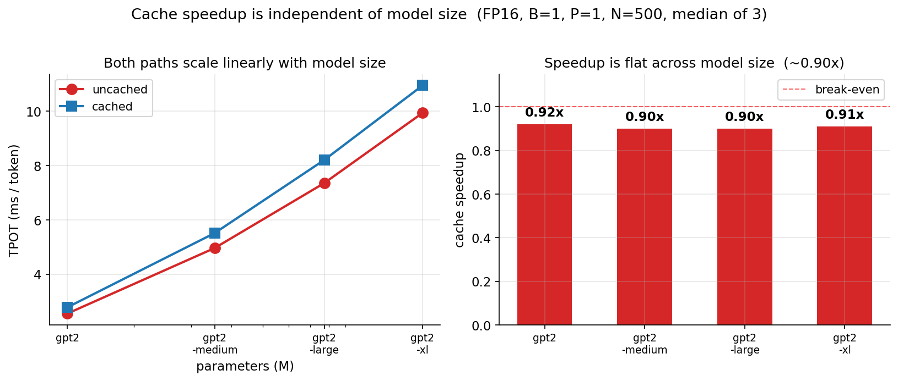
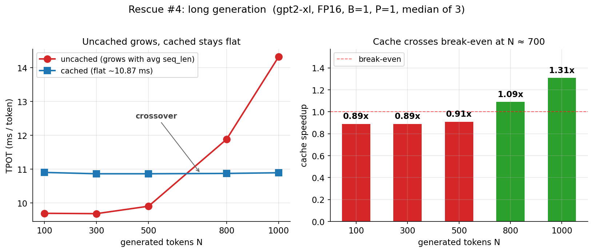

> What stays constant across sizes? What grows with \\(N\\)? Does anything surprise you?

---

## Appendix A2 — FP8: A Cautionary Tale

> *This appendix corresponds to the legacy `step-9-fp8/` folder. It is included as a deliberately negative result.*

### What we're checking
> One sentence. Is naive `dtype=fp8_e4m3` attention a free speedup on H100?

### The idea
> One paragraph. What scaling does FP8 require to be both fast *and* numerically stable? What does "naive" mean in the script's context?

### Running it

```bash
cd step-9-fp8/
python bench_fp8.py
```

### Plot

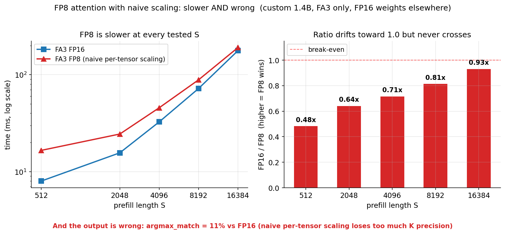

> Why is the naive path slower at the tested lengths? Why is it numerically unstable? What would a production FP8 stack add that this script does not?

---

## References

- **Andrej Karpathy** — [nanoGPT](https://github.com/karpathy/nanoGPT). The architecture, the weight-loading-from-HF pattern, and the small forward pass are all his.
- **Tri Dao et al.** — [FlashAttention](https://github.com/Dao-AILab/flash-attention) papers and the prebuilt FA3 wheel for Hopper.
- **PyTorch SDPA team** — the dispatcher behind `F.scaled_dot_product_attention` that picks between Flash, cuDNN, and memory-efficient implementations.

---

*Code, logs, and plot scripts: [github.com/venkatacrc/nanogpt-kv-cache](https://github.com/venkatacrc/nanogpt-kv-cache).*
